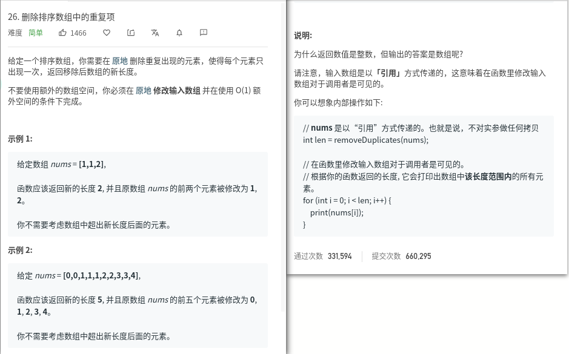
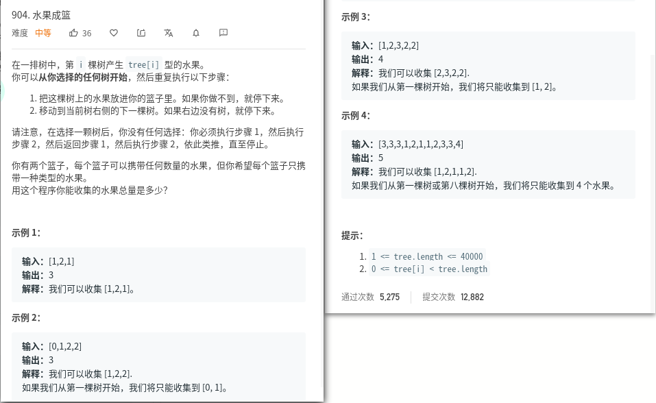

## 今天主要目标

### [26.删除排序数组中的重复项](https://leetcode-cn.com/problems/remove-duplicates-from-sorted-array/)

### [904.水果成篮](https://leetcode-cn.com/problems/fruit-into-baskets/) `该题第一次接触，虽然理解了，但是要多复习`

