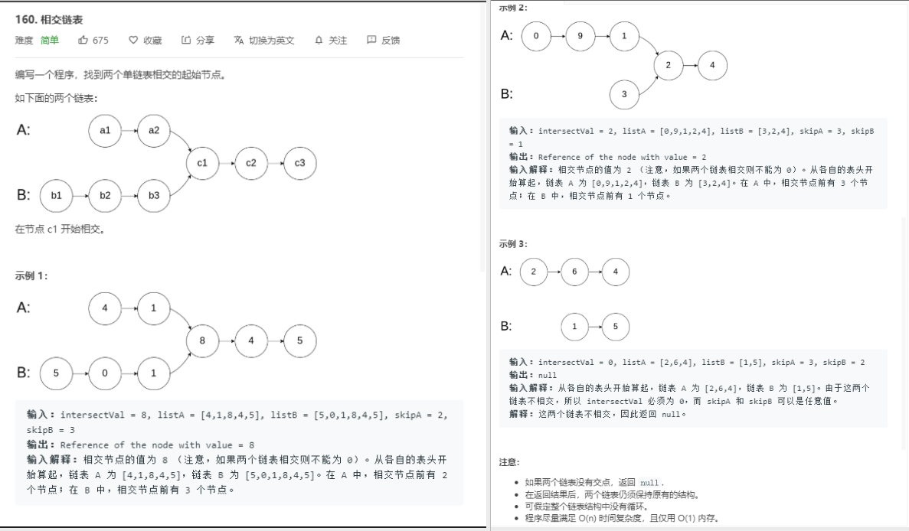
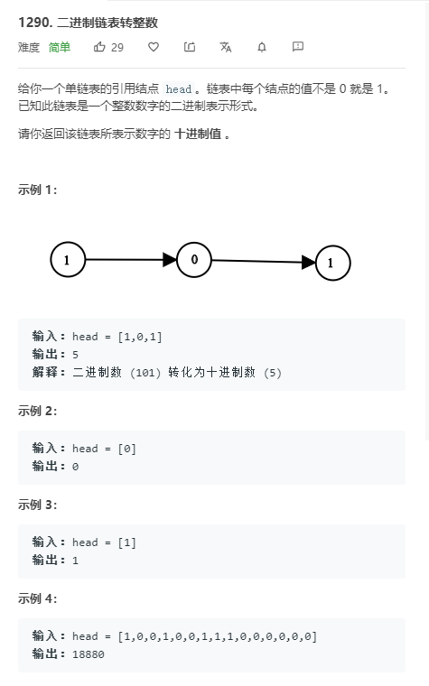
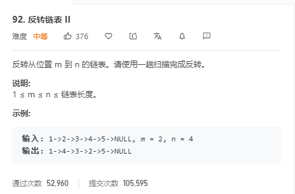
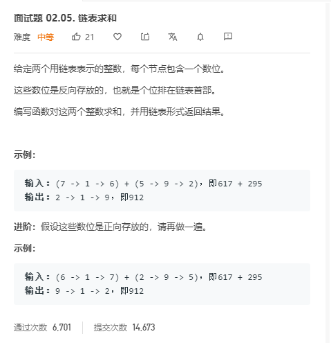

## 今天主要目标

### [160.相交链表](https://leetcode-cn.com/problems/intersection-of-two-linked-lists/)

### [1290.二进制链表转整数](https://leetcode-cn.com/problems/convert-binary-number-in-a-linked-list-to-integer/)

### [92.反转链表II](https://leetcode-cn.com/problems/reverse-linked-list-ii/)

### [面试题02.05.链表求和](https://leetcode-cn.com/problems/sum-lists-lcci/)

